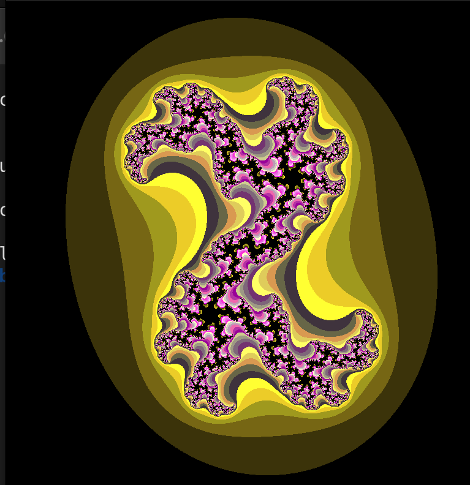
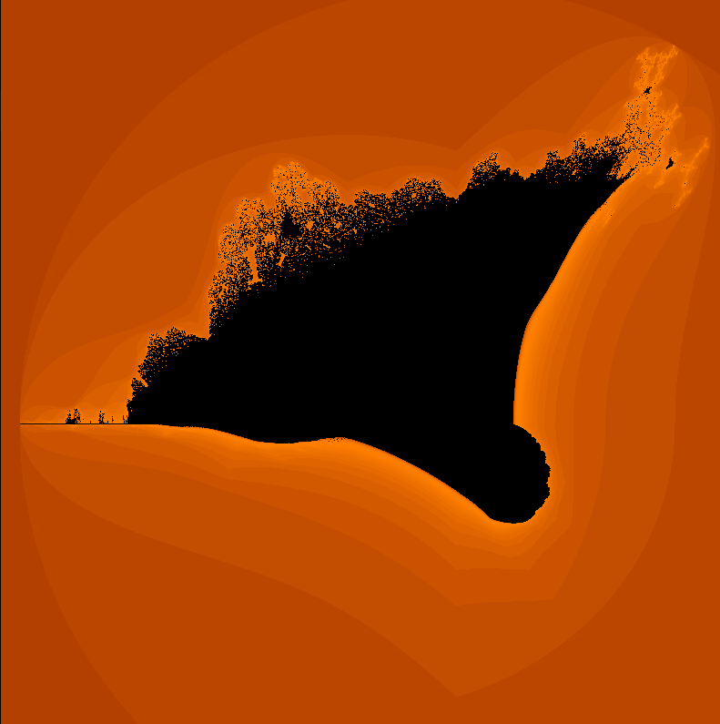

<p align="center">
  
</p>

<h1 align="center">fractol</h1>

<p align="center">
  
  
  
</p>

<p align="center">
  A graphical exploration of mathematical fractals using the MiniLibX library.
</p>

---

## About

**fractol** is a 42 school project that renders beautiful fractals in real-time. The program implements three different fractal sets with interactive navigation, zoom capabilities, and color gradients. This project introduces computer graphics programming using the MiniLibX library.

---

## Screenshots

<p align="center">
  
  
  
</p>

<p align="center">
  <em>Mandelbrot Set | Julia Set | Burning Ship</em>
</p>

---

## Features

- **3 Fractal Types:** Mandelbrot, Julia, and Burning Ship
- **Real-time Zoom:** Mouse scroll for infinite zoom exploration
- **Keyboard Navigation:** Arrow keys and WASD for panning
- **Julia Parameters:** Adjustable complex constant with +/- keys
- **Color Gradients:** Smooth coloring based on iteration escape
- **View Reset:** Instant reset with spacebar

---

## Supported Fractals

| Fractal | Formula | Description |
|---------|---------|-------------|
| **Mandelbrot** | `z(n+1) = z(n)² + c` | Classic fractal where `c` is the pixel coordinate |
| **Julia** | `z(n+1) = z(n)² + c` | `c` is a constant, `z(0)` is the pixel coordinate |
| **Burning Ship** | `z(n+1) = (\|Re(z)\| + i\|Im(z)\|)² + c` | Variant using absolute values |

---

## Controls

### Keyboard

| Key | Action |
|-----|--------|
| `ESC` | Exit program |
| `Space` | Reset view |
| `W` / `↑` | Move up |
| `S` / `↓` | Move down |
| `A` / `←` | Move left |
| `D` / `→` | Move right |
| `+` | Increase Julia constant |
| `-` | Decrease Julia constant |

### Mouse

| Action | Effect |
|--------|--------|
| Scroll Up | Zoom out |
| Scroll Down | Zoom in |

---

## Functions

### Core Functions

| Function | File | Description |
|----------|------|-------------|
| `main` | `fractol.c` | Entry point, initializes and runs the program |
| `ft_parse_args` | `fractol.c` | Parses command line arguments |
| `init_fractol` | `fractol.c` | Initializes MLX, window, and data structures |
| `free_fractol` | `fractol.c` | Cleans up resources and exits |

### Rendering Functions

| Function | File | Description |
|----------|------|-------------|
| `full_screen` | `fractol_utils.c` | Renders entire fractal frame |
| `put_pixel` | `fractol_utils.c` | Writes pixel to image buffer |
| `get_color` | `fractol_utils.c` | Applies brightness to color |
| `orange_color` | `fractol_utils.c` | Generates Burning Ship gradient |

### Fractal Algorithms

| Function | File | Description |
|----------|------|-------------|
| `mandelbrot` | `math.c` | Calculates Mandelbrot iteration |
| `burning_ship` | `math.c` | Calculates Burning Ship iteration |
| `julia` | `julia.c` | Calculates Julia set iteration |
| `init_julia` | `julia.c` | Initializes Julia parameters |
| `ft_atod` | `julia.c` | Converts string to double |

### Color Functions

| Function | File | Description |
|----------|------|-------------|
| `create_trgb` | `colors.c` | Creates TRGB color from components |
| `get_t` | `colors.c` | Extracts transparency component |
| `get_r` | `colors.c` | Extracts red component |
| `get_g` | `colors.c` | Extracts green component |
| `get_b` | `colors.c` | Extracts blue component |

### Event Handling

| Function | File | Description |
|----------|------|-------------|
| `hook_events` | `hook.c` | Registers all event hooks |
| `key_hook` | `hook.c` | Handles keyboard events |
| `mouse_scroll` | `hook.c` | Handles zoom with mouse scroll |
| `handle_julia_keys` | `hook.c` | Handles Julia +/- controls |

---

## Compilation

```bash
# Clone the repository
git clone git@github.com:FumiVZ/fractol.git
cd fractol

# Compile
make

# Clean object files
make clean

# Full clean (objects + executable)
make fclean

# Recompile
make re
```

### Requirements

- GCC compiler
- X11 development libraries (`libx11-dev`, `libxext-dev`)
- Make

---

## Usage

```bash
# Mandelbrot set
./fractol mandelbrot
./fractol 1

# Julia set with custom parameters
./fractol julia -0.7 0.27015
./fractol 2 -0.4 0.6

# Burning Ship
./fractol burningship
./fractol 3
```

### Julia Set Examples

| Parameters | Result |
|------------|--------|
| `-0.7 0.27015` | Classic Julia |
| `0 1` | Dendrite pattern |
| `-0.4 0.6` | Spiral Julia |
| `-0.8 0.156` | Dragon fractal |

---

## Project Structure

```
fractol/
├── fractol.c           # Main entry point
├── fractol_utils.c     # Rendering utilities
├── fractol.h           # Header file
├── hook.c              # Event handling
├── julia.c             # Julia set implementation
├── math.c              # Mandelbrot & Burning Ship
├── colors.c            # Color manipulation
├── Makefile            # Build system
├── libft/              # Custom C library
└── minilibx-linux-master/  # Graphics library
```

---

## Author

<table>
  <tr>
    <td align="center">
      <a href="https://github.com/FumiVZ">
        <br />
        <sub><b>vzuccare</b></sub>
      </a>
      <br />
      <a href="https://profile.intra.42.fr/users/vzuccare">42 Intra</a>
    </td>
  </tr>
</table>

---

<p align="center">
  Made with  at <strong>42 Lyon</strong>
</p>
